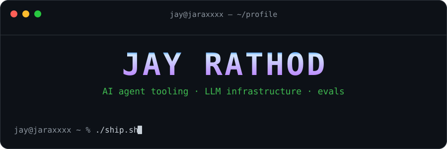

<!-- ⚡ Jaraxxxx/Jaraxxxx — profile README. Snake SVGs are auto-generated by .github/workflows/snake.yml into the `output` branch. -->



<div align="center">
  <a href="https://github.com/Jaraxxxx">
    
  </a>
</div>

## `~ $ whoami`

```console
jay@jaraxxxx ~ % whoami
ai infra engineer @ Swiggy — building agent tooling, LLM observability & evals
jay@jaraxxxx ~ % cat focus.txt
agent harnesses · MCP servers · LLM gateways · evals · quantization
jay@jaraxxxx ~ % ls prev-life/
recommender-systems   computer-vision   ann-solvers   spring-boot   dsa
jay@jaraxxxx ~ % ▊
```

## ⚡ now building

**the pi ecosystem — extensions for the [pi coding agent](https://github.com/earendil-works/pi):**

| project | what it does |
| --- | --- |
| [**pi-extensions**](https://github.com/Jaraxxxx/pi-extensions) | collection of extensions for the pi coding agent |
| [**pi-usage-dashboard**](https://github.com/Jaraxxxx/pi-usage-dashboard) | live session/token stats inside your agent's chat footer |
| [**pi-context-whisperer**](https://github.com/Jaraxxxx/pi-context-whisperer) | gradual auto-compaction before the context window bites |
| [**pi-smart-commit**](https://github.com/Jaraxxxx/pi-smart-commit) | conventional commit messages generated from session diffs |
| [**pi-session-exporter**](https://github.com/Jaraxxxx/pi-session-exporter) | export agent sessions as clean Markdown for PRs, issues & Slack |
| [**forge**](https://github.com/Jaraxxxx/forge) | one codebase, two interfaces — CLI for terminals, Web for the visual folk |

## 🧰 stack

<div align="center">
  <br/>
  
</div>

## 🧭 deep dive

<picture>
  <source media="(prefers-color-scheme: dark)" srcset="https://github-profile-summary-cards.vercel.app/api/cards/profile-details?username=Jaraxxxx&theme=github_dark" />
  <source media="(prefers-color-scheme: light)" srcset="https://github-profile-summary-cards.vercel.app/api/cards/profile-details?username=Jaraxxxx&theme=github" />
  
</picture>

<table>
  <tr>
    <td width="50%" align="center">
      <picture>
        <source media="(prefers-color-scheme: dark)" srcset="https://github-profile-summary-cards.vercel.app/api/cards/repos-per-language?username=Jaraxxxx&theme=github_dark" />
        <source media="(prefers-color-scheme: light)" srcset="https://github-profile-summary-cards.vercel.app/api/cards/repos-per-language?username=Jaraxxxx&theme=github" />
        
      </picture>
    </td>
    <td width="50%" align="center">
      <picture>
        <source media="(prefers-color-scheme: dark)" srcset="https://github-profile-summary-cards.vercel.app/api/cards/most-commit-language?username=Jaraxxxx&theme=github_dark" />
        <source media="(prefers-color-scheme: light)" srcset="https://github-profile-summary-cards.vercel.app/api/cards/most-commit-language?username=Jaraxxxx&theme=github" />
        
      </picture>
    </td>
  </tr>
  <tr>
    <td width="50%" align="center">
      <picture>
        <source media="(prefers-color-scheme: dark)" srcset="https://github-profile-summary-cards.vercel.app/api/cards/stats?username=Jaraxxxx&theme=github_dark" />
        <source media="(prefers-color-scheme: light)" srcset="https://github-profile-summary-cards.vercel.app/api/cards/stats?username=Jaraxxxx&theme=github" />
        
      </picture>
    </td>
    <td width="50%" align="center">
      <picture>
        <source media="(prefers-color-scheme: dark)" srcset="https://github-profile-summary-cards.vercel.app/api/cards/productive-time?username=Jaraxxxx&theme=github_dark" />
        <source media="(prefers-color-scheme: light)" srcset="https://github-profile-summary-cards.vercel.app/api/cards/productive-time?username=Jaraxxxx&theme=github" />
        
      </picture>
    </td>
  </tr>
</table>

## 💭 quote of the day

<p align="center">
  <picture>
    <source media="(prefers-color-scheme: dark)" srcset="https://quotes-github-readme.vercel.app/api?type=horizontal&theme=dark" />
    <source media="(prefers-color-scheme: light)" srcset="https://quotes-github-readme.vercel.app/api?type=horizontal&theme=light" />
    
  </picture>
</p>

## 📊 metrics

<table>
  <tr>
    <td width="50%" align="center">
      <picture>
        <source media="(prefers-color-scheme: dark)" srcset="https://github-readme-stats-sigma-five.vercel.app/api?username=Jaraxxxx&show_icons=true&hide_border=true&include_all_commits=true&count_private=true&theme=dark" />
        <source media="(prefers-color-scheme: light)" srcset="https://github-readme-stats-sigma-five.vercel.app/api?username=Jaraxxxx&show_icons=true&hide_border=true&include_all_commits=true&count_private=true" />
        
      </picture>
    </td>
    <td width="50%" align="center">
      <picture>
        <source media="(prefers-color-scheme: dark)" srcset="https://streak-stats.demolab.com?user=Jaraxxxx&hide_border=true&theme=dark" />
        <source media="(prefers-color-scheme: light)" srcset="https://streak-stats.demolab.com?user=Jaraxxxx&hide_border=true&theme=light" />
        
      </picture>
    </td>
  </tr>
</table>

<p align="center">
  <a href="https://leetcode.com/u/jaraxxxx/">
    
  </a>
</p>

## 🐍 snake says hi

<picture>
  <source media="(prefers-color-scheme: dark)" srcset="https://raw.githubusercontent.com/Jaraxxxx/Jaraxxxx/output/github-contribution-grid-snake-dark.svg" />
  <source media="(prefers-color-scheme: light)" srcset="https://raw.githubusercontent.com/Jaraxxxx/Jaraxxxx/output/github-contribution-grid-snake.svg" />
  
</picture>

## 📮 connect

<div align="center">
  <a href="https://www.linkedin.com/in/jaraxxxx">
    
  </a>
  &nbsp;
  <a href="https://leetcode.com/u/jaraxxxx/">
    
  </a>
  &nbsp;
  <a href="mailto:jay.m.rathod.01@gmail.com">
    
  </a>
</div>


